# Projet Développement Multimédia

ce module va permettre a l’utilisateur de capturer une photo depuis la camera de son pc  . Ce module sera utilisable dans les applications Web, Mobiles hybrides et Desktop basées sur les technologies WEB.

## Getting Started

These instructions will get you a copy of the project up and running on your local machine for development and testing purposes. See deployment for notes on how to deploy the project on a live system.

### Prerequisites

 Node.js 
 npm

### Installing
installation de Nodejs
Allez sur la page officielle de Node.js et téléchargez le package d'installation correspondant à votre système d'exploitation. Utilisez la version LTS et non la version actuelle.

Une fois le téléchargement terminé, installez le package comme n'importe quelle autre application sur votre Mac ou PC.

 installation de express 
 il faut tapez la commande :  
 $ npm install express-generator -g  
 
 $ express -v ejs -c sass myapp. Dans cet exemple, myapp sera le nom de votre projet. 
 ensuit  
 $ cd myapp. 
 
 dossier du projet 
 
 ## Running the tests
 
 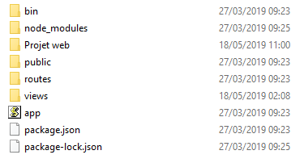 
 
lancement de l'application

 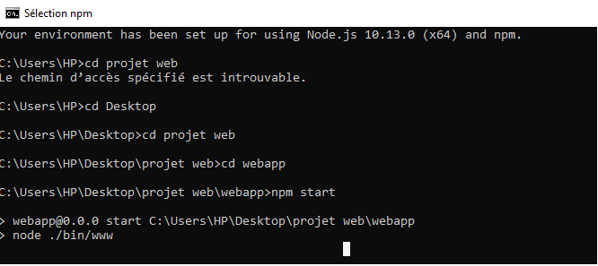 
 
page d'accueil l'utilisateur doit cliquer sur l'icon pour commencer .

 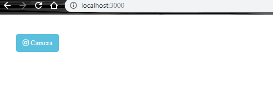 
 
l'utilisateur doit cliquer sur prendre une photo ensuit apres 3 seconds la photo va être pris

 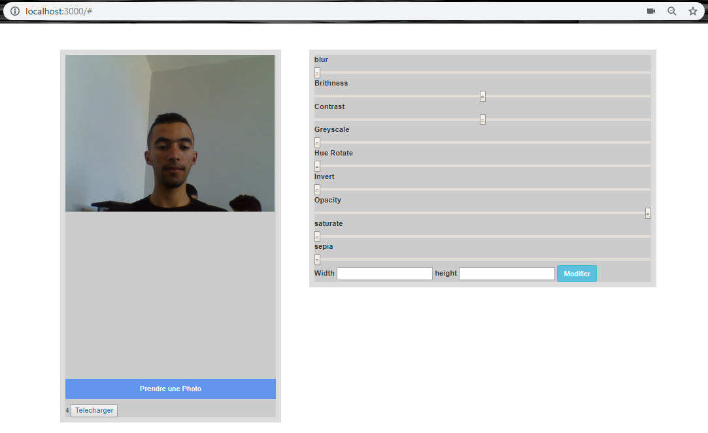 

Photo pris avec succes 

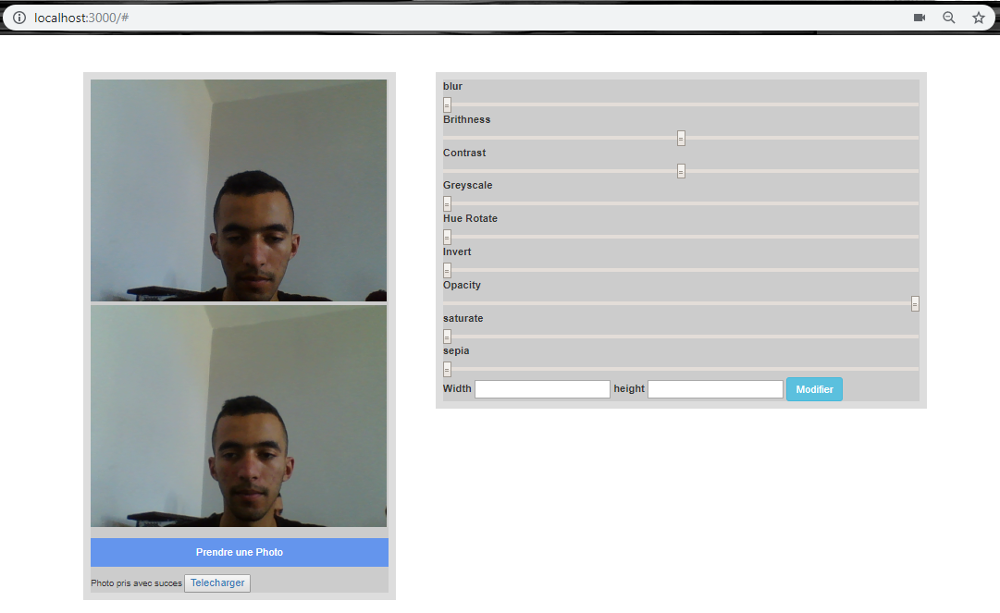 

telechargement de l'image (l'utilisateur doit cliquer sur telecharger l'image)

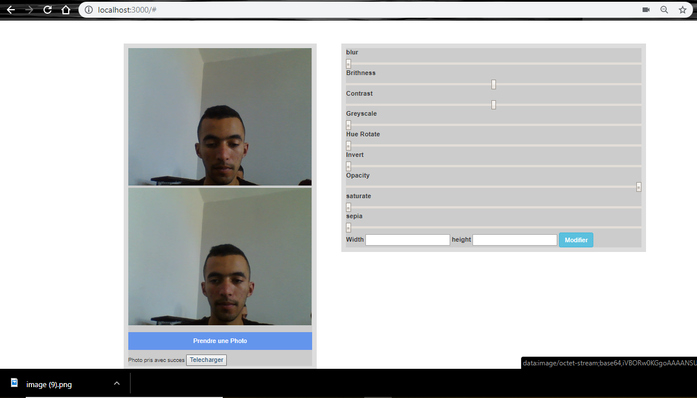 

ouverture de l'image sur windows photo

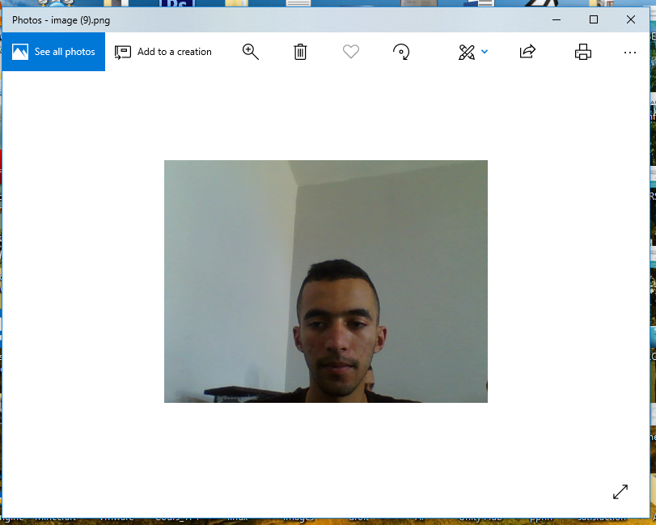 

### Application des filtres sur la photo 

L'utilisateur peut ajouter plusieurs filtre a la photo 

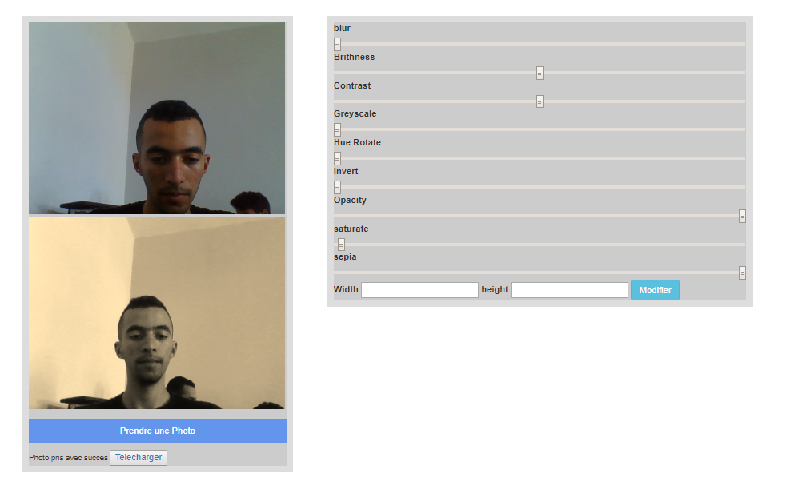 

Enregistement de l'image filtrer
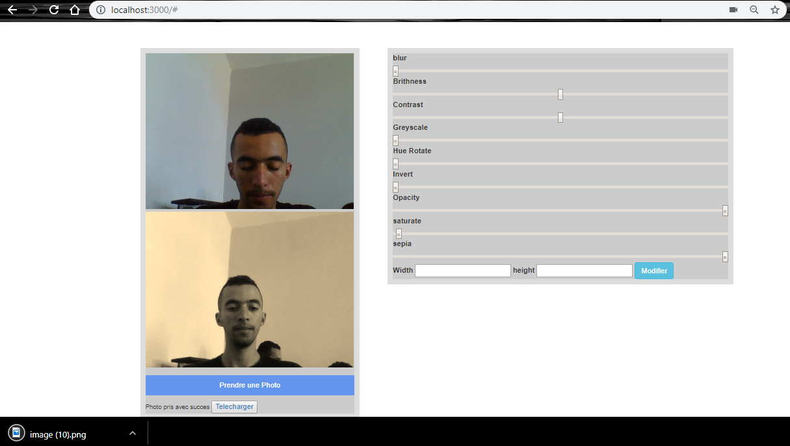 
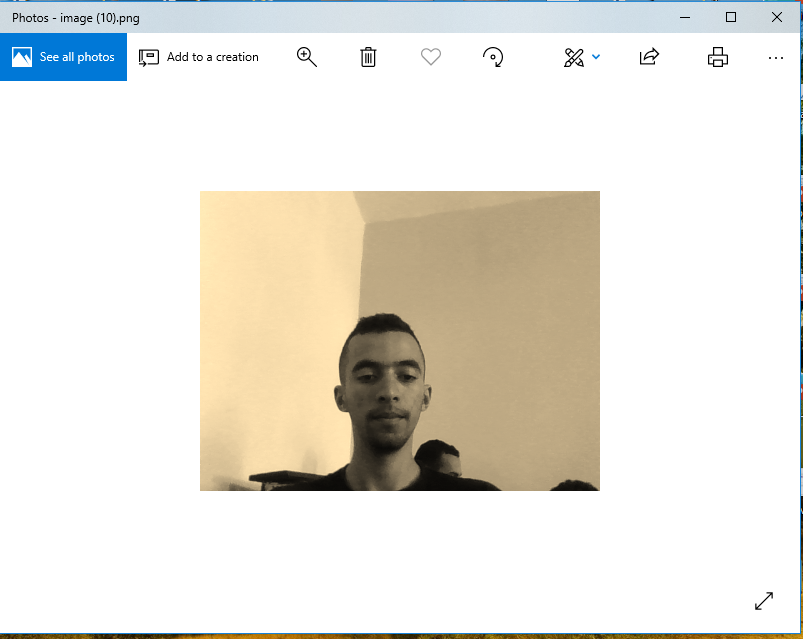 

### Code et functions

function de depart 
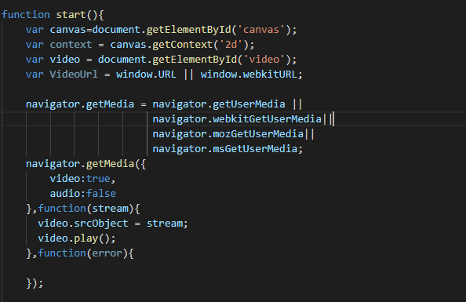 

function de telechargement 
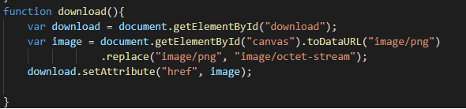 

function apply filter
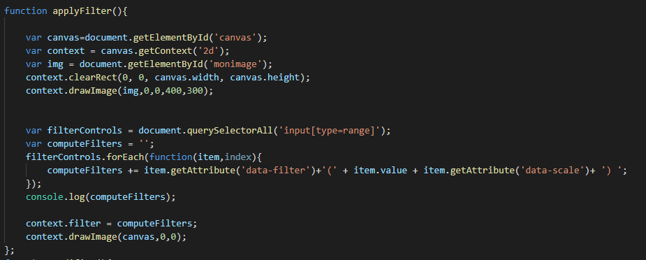 

partie du html
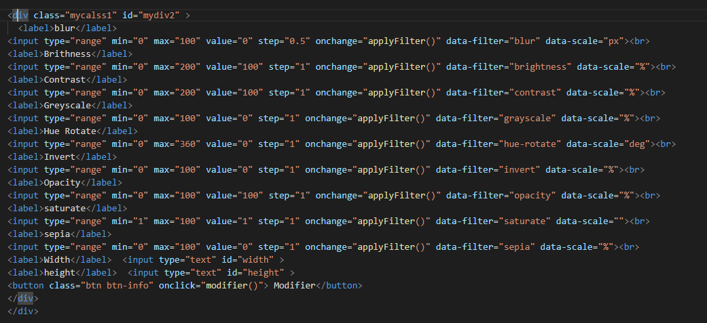 

## Versioning

We use [SemVer](http://semver.org/) for versioning. For the versions available, see the [tags on this repository](https://github.com/your/project/tags). 

## Authors

* **Joubair hatim** 

