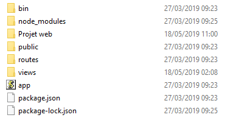

# Projet Développement Multimédia

ce module va permettre a l’utilisateur de capturer une photo depuis la camera de son pc  . Ce module sera utilisable dans les applications Web, Mobiles hybrides et Desktop basées sur les technologies WEB.

## Getting Started

These instructions will get you a copy of the project up and running on your local machine for development and testing purposes. See deployment for notes on how to deploy the project on a live system.

### Prerequisites

 Node.js
 npm


### Installing
installation de Nodejs
Allez sur la page officielle de Node.js et téléchargez le package d'installation correspondant à votre système d'exploitation. Utilisez la version LTS et non la version actuelle.

Une fois le téléchargement terminé, installez le package comme n'importe quelle autre application sur votre Mac ou PC.

 installation de express
 il faut tapez la commande : 
 $ npm install express-generator -g
 
 $ express -v ejs -c sass myapp. Dans cet exemple, myapp sera le nom de votre projet.
 ensuit 
 $ cd myapp.
 
 dossier du projet 
 <br>

## Running the tests

Explain how to run the automated tests for this system

### Break down into end to end tests

Explain what these tests test and why

```
Give an example
```

### And coding style tests

Explain what these tests test and why

```
Give an example
```

## Deployment

Add additional notes about how to deploy this on a live system

## Built With

* [Dropwizard](http://www.dropwizard.io/1.0.2/docs/) - The web framework used
* [Maven](https://maven.apache.org/) - Dependency Management
* [ROME](https://rometools.github.io/rome/) - Used to generate RSS Feeds

## Contributing

Please read [CONTRIBUTING.md](https://gist.github.com/PurpleBooth/b24679402957c63ec426) for details on our code of conduct, and the process for submitting pull requests to us.

## Versioning

We use [SemVer](http://semver.org/) for versioning. For the versions available, see the [tags on this repository](https://github.com/your/project/tags). 

## Authors

* **Billie Thompson** - *Initial work* - [PurpleBooth](https://github.com/PurpleBooth)

See also the list of [contributors](https://github.com/your/project/contributors) who participated in this project.

## License

This project is licensed under the MIT License - see the [LICENSE.md](LICENSE.md) file for details

## Acknowledgments

* Hat tip to anyone whose code was used
* Inspiration
* etc

